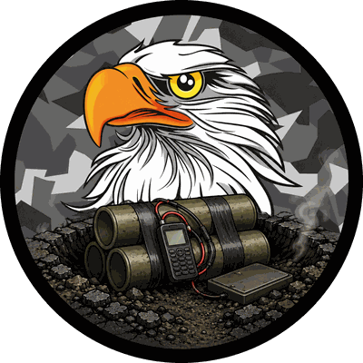
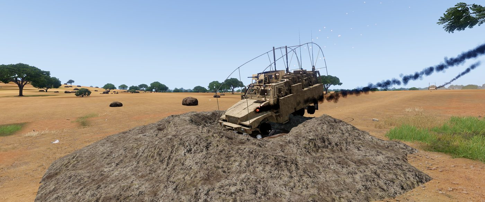
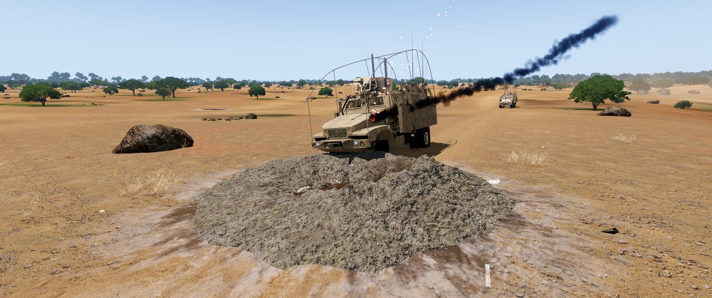
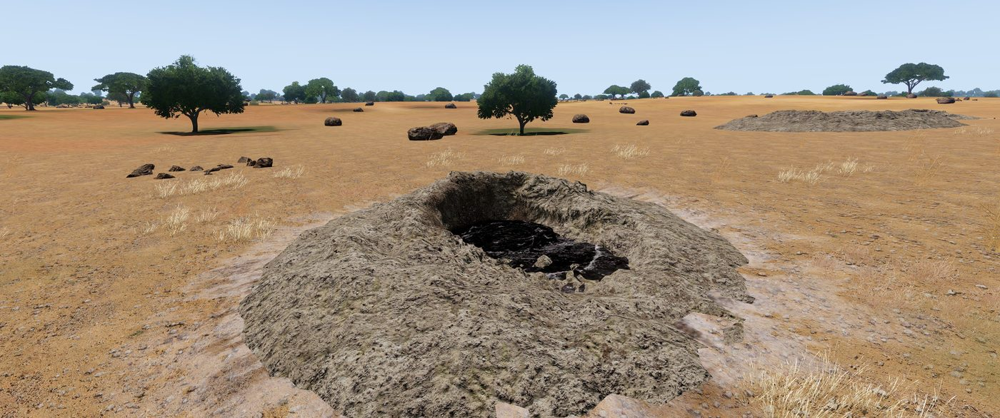
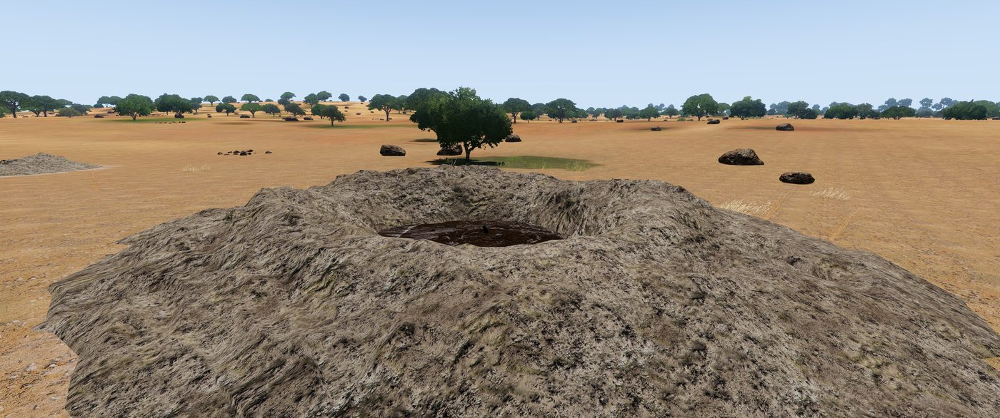
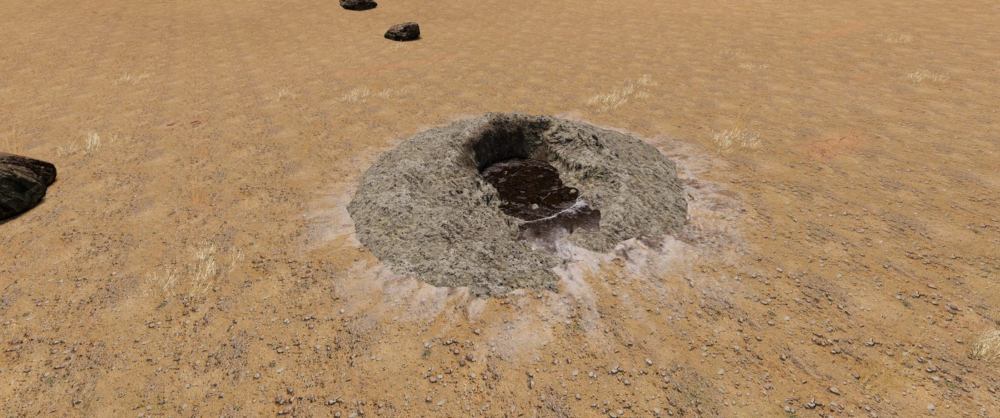

<p align="center">
  
</p>

# TLB - IEDs

An Arma 3 addon that adds TLB-branded copies of the eight vanilla and ACE IED
types. Each one leaves a **persistent crater** where it detonates — without
launching or trapping the vehicle that set it off.

Requires **CBA_A3** and **ACE3** (`ace_explosives`). Built and tested against
ACE 3.21.2, Arma 3 v2.10+.

<p align="center">
  
</p>

---

## What it does

Standard ACE IEDs detonate and leave nothing behind. These behave identically in
every other respect — defusing, pressure plates, cellphone, clacker and dead man
switch are all inherited unchanged — but they scar the ground permanently, so a
route that has been hit *looks* like it has been hit for the rest of the mission.

The hard part isn't spawning the crater. It's spawning a solid 3D object inside
the hull of the vehicle that just drove over it, without the physics engine
firing that vehicle into the sky. See [The anti-stuck problem](#3-the-anti-stuck-problem).

## Demo

[](https://youtu.be/1AH5ukcfTso)

## Screenshots

<table>
  <tr>
    <td width="50%">
      
      <br><em>Lands on the crater, not inside it — and drives out.</em>
    </td>
    <td width="50%">
      
      <br><em>The crater is permanent: the route stays scarred.</em>
    </td>
  </tr>
  <tr>
    <td width="50%">
      
      <br><em>Each crater is randomly rotated, so repeat hits never look cloned.</em>
    </td>
    <td width="50%">
      
      <br><em>Crater size is a per-IED setting — see <a href="#crater-selection">Crater selection</a>.</em>
    </td>
  </tr>
</table>

## Installation

**Clients** — load `@TLB - IEDs` alongside CBA and ACE.

**Server** — copy `@TLB - IEDs` to the server, add it to `-mod=`, and install
`keys/TLBIEDs01.bikey` into the server's `keys/` folder so the signature
verifies.

## Classes

| Display name | Mine class | Zeus module | Default crater |
|---|---|---|---|
| TLB IED (Large, Dug-in) | `TLB_IEDLandBig` | `TLB_ModuleExplosive_IEDLandBig` | Large |
| TLB IED (Large, Dug-in, Pressure Plate) | `TLB_IEDLandBig_Range` | `TLB_ModuleExplosive_IEDLandBig_Range` | Large |
| TLB IED (Large, Urban) | `TLB_IEDUrbanBig` | `TLB_ModuleExplosive_IEDUrbanBig` | Large |
| TLB IED (Large, Urban, Pressure Plate) | `TLB_IEDUrbanBig_Range` | `TLB_ModuleExplosive_IEDUrbanBig_Range` | Large |
| TLB IED (Small, Dug-in) | `TLB_IEDLandSmall` | `TLB_ModuleExplosive_IEDLandSmall` | Medium |
| TLB IED (Small, Dug-in, Pressure Plate) | `TLB_IEDLandSmall_Range` | `TLB_ModuleExplosive_IEDLandSmall_Range` | Medium |
| TLB IED (Small, Urban) | `TLB_IEDUrbanSmall` | `TLB_ModuleExplosive_IEDUrbanSmall` | Medium |
| TLB IED (Small, Urban, Pressure Plate) | `TLB_IEDUrbanSmall_Range` | `TLB_ModuleExplosive_IEDUrbanSmall_Range` | Medium |

Those are only the **defaults** — every IED type has its own CBA setting, so you
can give each one any crater size, turn its crater off, or set it to Random. See
[Crater selection](#crater-selection).

In Eden they sit under **Empty → Explosives → TLB IEDs**. In Zeus, place them
through the modules in the right-hand column.

Only the display name, the ammo class and the crater differ from the originals.
Craters are **not** added to the stock vanilla/ACE IEDs, so existing missions
behave exactly as they always have — mission makers opt in by placing the TLB
versions.

---

## How it works

### 1. Catching the detonation

The hook lives on the **ammo**, not on the mine object:

```cpp
class TLB_IEDLandBig_Remote_Ammo: IEDLandBig_Remote_Ammo {
    TLB_craterSetting = "TLB_IEDs_craterLandBig";   // which CBA setting decides
    TLB_craterDefault = 3;                          // what it defaults to
    class EventHandlers {
        init = "call TLB_IEDs_fnc_initMine";
    };
};
```

Note that the crater itself is **not** named here. Each ammo class only points at
the setting that decides it, so crater choice stays configurable at runtime
rather than baked into the PBO.

That `init` handler fires wherever the mine is local. It is the same mechanism
ACE uses for its trip flares, and putting it on the ammo means it works however
the IED reached the world — Eden, a Zeus module, `createMine`, or an ACE player
placement.

`fnc_initMine.sqf` then attaches an `Explode` handler to the mine:

```sqf
_mine addEventHandler ["Explode", {
    params ["_projectile", "_posASL"];
    ...
}];
```

`Explode` fires **only on a genuine detonation**. Defusing deletes the mine
without firing it, so EOD work never leaves a phantom crater — no extra
bookkeeping is needed to tell the two apart.

### 2. Building the crater

The `Explode` handler asks the **server** to create the crater, so it exists once
and globally. `fnc_spawnCrater.sqf` snaps it flush to the terrain, gives it a
random rotation (so repeat hits along one route don't look cloned) and disables
damage on it. It appears instantly.

### 3. The anti-stuck problem

`Land_ShellCrater_02_*` are 3D bowls with real collision geometry. A crater
appearing *inside* a vehicle's hull is deep mesh penetration, and the physics
engine resolves that the only way it knows how: by firing the vehicle into the
air.

**The fix is to make sure nothing is standing there when the crater appears.**
Anything inside the crater's footprint is raised one metre first, and the crater
forms underneath it. No penetration, so nothing to resolve. The vehicle then
drops onto the finished crater and drives out normally.

**Ordering is the whole trick.** The lift is fired from the `Explode` handler as
a *global* event, straight to every machine, **before** the server is even asked
to build the crater:

```sqf
["TLB_IEDs_blastLift",   [_craterType, _posASL]]          call CBA_fnc_globalEvent;
["TLB_IEDs_spawnCrater", [_craterType, _posASL, _radius]] call CBA_fnc_serverEvent;
```

The crater has to round-trip through the server before it can exist anywhere, so
the lift is always ahead of the thing it protects against, however slow the link
is. A one-second hold then stops the vehicle falling back down in that gap — it
holds height above *ground*, so it keeps working while the vehicle is still
moving.

Two deliberate non-behaviours, both learned the hard way:

- **Crew are never lifted.** Only troops on foot are candidates
  (`isNull objectParent`). Lifting a unit that is sitting in a vehicle rips it
  out of its seat, and the vehicle lift already carries its crew along with it.
- **`disableCollisionWith` is not used.** That was the original design, and it
  was tested: the pairwise suppression was verifiably applied to the vehicle and
  the vehicle was still launched. It does not work against a static crater
  object, so it was removed rather than left in looking like a safety net.

The lift radius is read from the crater model itself via `sizeOf` rather than
hardcoded, so only things genuinely in the hole get moved, and it stays correct
if the crater types are ever changed.

Each machine only moves what is **local** to it — `setPos` on a remote object
desyncs.

---

## Settings

Under **TLB - IEDs** in the CBA settings menu. All server-forced.

| Setting | Default | Notes |
|---|---|---|
| Spawn craters | on | Master switch. |
| Lift infantry too | on | Also lift troops on foot. Never affects vehicle crew. |
| Lift height | 1.0 m | Raise this if a vehicle still catches the crater's lip. |
| Lift hold | 1.0 s | Stops a lifted vehicle dropping back before the crater exists. 0 for a single instant lift. |
| Max craters | 0 | 0 = unlimited; craters are permanent. Raise above 0 only as a safety valve on very long operations, where it removes the oldest first. |

### Crater selection

Each of the eight IED types has its own `Crater: ...` setting, so a dug-in large
IED and an urban one can leave completely different holes, and the pressure-plate
variants can differ from the command-detonated ones. Options:

| Option | Object |
|---|---|
| None | no crater for this IED type |
| Small | `Land_ShellCrater_01_F` |
| Medium | `Land_ShellCrater_02_small_F` |
| Large | `Land_ShellCrater_02_large_F` |
| Extra Large | `Land_ShellCrater_02_extralarge_F` |
| Random | a different one of the four sizes on every detonation |

Random is resolved **once**, on the machine the IED detonated on, and the chosen
classname is then sent to everyone. If each machine rolled its own, the lift
would size itself against a different crater than the one that actually appears.

Adding another size is a one-line change to `TLB_IEDs_craterTypes` in
`XEH_preInit.sqf` — it offers itself in all eight settings automatically.

## Diagnostics

The addon logs to the `.rpt`. A healthy detonation looks like this:

```
[TLB_IEDs] preInit complete
[TLB_IEDs] armed TLB_IEDLandBig_Range
[TLB_IEDs] lifted 1 entities by 1m (r5.5)
[TLB_IEDs] crater Land_ShellCrater_02_large_F at [...]
```

Those map to the four stages, which makes a failure easy to localise:

| Last line seen | Meaning |
|---|---|
| *nothing* | The PBO prefix is wrong — look for `Script \tlb\ieds\XEH_preInit.sqf not found`. |
| `preInit complete` | Functions loaded, but the ammo `init` handler never fired. |
| `armed` | The mine was hooked, but `Explode` never fired — it was defused, not detonated. Or this IED type's crater setting is **None**. |
| `lifted` | Crater creation failed; check the classname in `TLB_IEDs_craterTypes` (`XEH_preInit.sqf`). |

## Building from source

Requires **Arma 3 Tools** (AddonBuilder, DSSignFile).

```powershell
.\build.ps1                     # build + sign into dist\
.\build.ps1 -Deploy             # also copy into the Arma !Workshop folder
.\build.ps1 -KeyName TLBMisc3   # sign with an existing key instead
```

The default key `TLBIEDs01` is generated into `private\` on first build.
`private\` is gitignored: **a `.biprivatekey` must never be published**, since
anyone holding it can sign a PBO that your server will accept as genuine TLB
content. Distribute only the `.bikey`.

Two things the build script does that are worth keeping:

- **It passes `-prefix=tlb\ieds` explicitly.** AddonBuilder ignores `$PBOPREFIX$`
  and silently names the prefix after the source folder instead.
- **It reads the prefix back out of the finished PBO and fails the build if it is
  wrong.** A bad prefix produces no build error at all — it surfaces only in game
  as a missing script, which is a miserable way to find out.

Packing uses `-packonly`. There are no models or textures here, only config and
SQF, so binarising would buy nothing and add a failure mode.

## Repository layout

```
addons/tlb_ieds/
  config.cpp              CfgPatches, XEH registration, editor subcategory
  CfgAmmo.hpp             8 ammo classes, crater assignment, detonation hook
  CfgVehicles.hpp         8 mines + 8 Zeus modules
  XEH_preInit.sqf         function compilation, CBA settings, event registration
  functions/
    fnc_initMine.sqf      attaches the Explode handler
    fnc_liftEntities.sqf  the anti-stuck lift (runs on every machine)
    fnc_spawnCrater.sqf   creates the crater (server only)
build.ps1                 pack, verify prefix, sign, optionally deploy
mod.cpp                   launcher metadata
```

## Testing

1. Load alongside CBA and ACE.
2. In Eden, place a player in a vehicle and a **TLB IED (Large, Dug-in, Pressure
   Plate)** on a road.
3. Drive over it. The IED detonates, a large crater appears at the exact spot,
   and the vehicle is **not** launched — it lands on the crater and, if still
   driveable, pulls out normally.
4. Confirm the crew are still *in* the vehicle.
5. Defuse a second IED instead of triggering it — no crater should appear.
6. Repeat on a dedicated server with two clients, to confirm the crater appears
   for both and that the lift applies on whichever machine owns the vehicle.

## Credits

Built for **TLB MilSim**.

Detonation hook pattern adapted from [ACE3](https://github.com/acemod/ACE3)
(`ace_explosives`), which is GPLv2.
